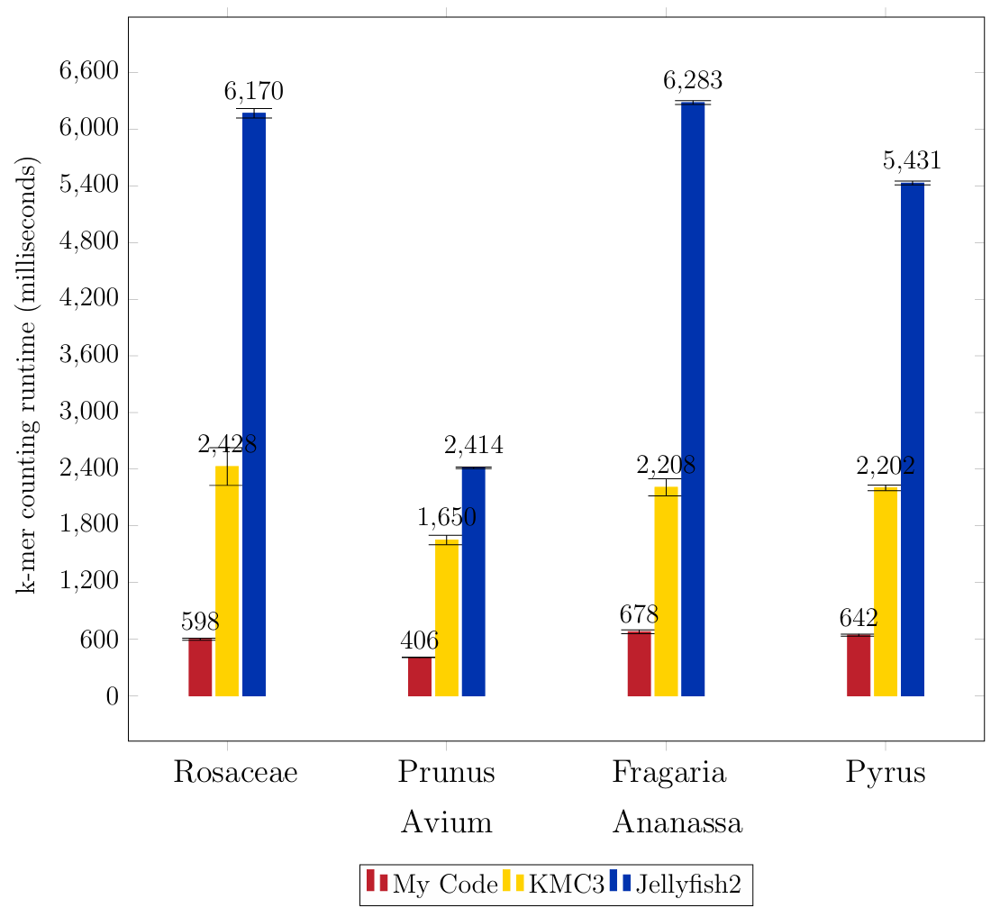

This k-mer counter was designed to tackle the increasing amount of data that accrues with the advent of Next Generation Sequencing and has made conventional k-mer counters too slow and memory intensive. It outperforms the three most commonly used k-mer counters KMC, Jellyfish, and Gerbil and achieves speedups of 3 to 4 compared to KMC, 5 to 10 compared to Jellyfish, and 2 to 4 compared to Gerbil. 

It can count k-mers for ks as large as 31 and has a fault-tolerant design for errors that occur while manually editing sequences. Warpcore hashmap is required.

Compilation was done with:  
`nvcc --extended-lambda kernel.cu`

Remarks:
- It is not recommended to print all k-mers except for low ks and or very large thresholds.
- Otherwise it is recommended to use a theshold of zero.
- The file format (Fastq/Fasta) has to be manually entered due to inconsistencies in file name extensions.
- Counts can differ from other k-mer counters but only due to a higher fault tolerance and, therefore, different interpretations of backslashes, spaces, and newlines.
